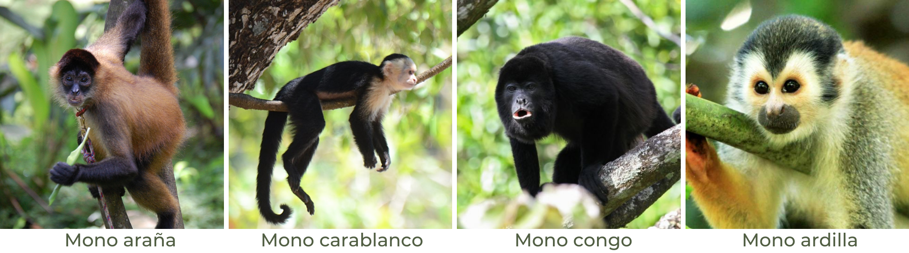

<br> 

### Introducción: 
En Costa Rica existen cuatro especies de primates:       
- araña o colorado _(Ateles geoffroyi)_     
- carablanca _(Cebus capucinus)_   
- congo o aullador _(Alouatta palliata)_   
- ardilla o tití _(Saimiri oerstedii)_.   

<br>

  

<br>

###### _Créditos de las fotografías_  
###### <https://es.wikipedia.org/wiki/Ateles_geoffroyi#/media/Archivo:Panama_spider_monkey,_Costa_Rica.JPG>      
###### <https://www.ucr.ac.cr/noticias/2019/05/08/la-realidad-de-los-monos-la-antesala-a-la-extincion.html>    
###### <https://www.govisitcostarica.co.cr/travelInfo/photo-gallery.asp?tag=monkeys-mammals>    
###### <https://www.riojarentacar.com/informacion/gran-variedad-de-monos-en-costa-rica/>    

<br>
<br>

En este trabajo se pretende crear una tabla interactiva de los registros de presencia de cada especie utlizando la función `datatable()` del paquete DT. Asismismo, un gráfico pastel que muestre el porcentaje para cada especie con el paquete `plotly`. Finalmente, se mapea la districión de especies con el paquete `leaflet`. 

<br>
<br>
 
### 1. Pasos preliminares
Se cargan los paquetes, se crean las data.frame y se asigna el sistema de coordenadas (CRS).

```{r initiate, message=FALSE}
# Carga de paquetes

library(dplyr)
library(sf)
library(DT)
library(plotly)
library(leaflet)
library(rgdal)
library(raster)
```

```{r, message=FALSE, warning=FALSE}
# Registros de presencia de primates
primates <-
  st_read(
    "https://raw.githubusercontent.com/gf0604-procesamientodatosgeograficos/2021i-datos/main/gbif/primates-cr-registros.csv",
    options = c(
      "X_POSSIBLE_NAMES=decimalLongitude",
      "Y_POSSIBLE_NAMES=decimalLatitude"
    ),
    quiet = TRUE
  )

# Asignación de CRS
st_crs(primates) = 4326

# Creación de capa geoespacial de cantones
cantones <-
  st_read(
    "https://raw.githubusercontent.com/gf0604-procesamientodatosgeograficos/2021i-datos/main/ign/delimitacion-territorial-administrativa/cr_cantones_simp_wgs84.geojson",
    quiet = TRUE
  )
```

<br>
<br>

### 2. Realización el cruce de datos con la capa de cantones con `st_join()`
```{r, warning=FALSE, message=FALSE}
# Cruce espacial con la tabla de cantones, para obtener el nombre del cantón
primates <- 
  primates %>%
  st_join(cantones["canton"])
```
<br>
<br>

### 3. Creación de la tabla de registros interactiva para cada especie de primate
```{r, message=FALSE}
# Tabla de registros de presencia
primates %>%
  st_drop_geometry() %>%
  dplyr::select(species, family, stateProvince, canton, eventDate) %>%
  datatable(
    colnames = c("Especie", "Familia", "Provincia", "Cantón", "Fecha"),
    options = list(searchHighlight = TRUE,      
                   language = list(url = '//cdn.datatables.net/plug-ins/1.10.25/i18n/Spanish.json'),
                   pageLength = 10)
  )
```
<br>
<br>

### 4. Creación de gráfico pastel por especie de primate
```{r fig.height=7, fig.width=7, warning=FALSE}

# Creación de paleta de colores
pal <- c("#ff3399", "#993399", "#ffcc00")

# Gráfico pastel de los registros de primates en Costa Rica
plot_ly(primates, labels = ~ species, type = "pie",
               textposition = 'inside',
               marker = list (colors = pal),
               textinfo = 'label+percent',
               hover = ~ 'Cantidad de registros',
               hoverinfo = "value",
               showlegend = FALSE) %>%
layout(title = "Porcentaje de registros de primates en Costa Rica")%>%
config(locale = "es")
```
<br>
<br>


### 5. Mapa de distribución

#### a. Creación de variables para cada especie de primate
```{r}
# Con filter() se filtran las especies de primates 
araña <- primates %>%
  filter(species == "Ateles geoffroyi")

carablanca <- primates %>%
  filter(species == "Cebus capucinus")


congo <- primates %>%
  filter (species == "Alouatta palliata")


ardilla <- primates %>% 
  filter (species == "Saimiri oerstedii")
```

<br>

#### b. Creación de capa de altitud con una paleta de colores adecuada
```{r}
# Capa de provincias
provincias <-
  st_read(
    "https://raw.githubusercontent.com/gf0604-procesamientodatosgeograficos/2021i-datos/main/ign/delimitacion-territorial-administrativa/cr_provincias_simp_wgs84.geojson",
    quiet = TRUE
  )


# Obtención de datos de la base de datos World Cilm
alt <- getData(
  "worldclim",
  var = "alt",
  res = .5,
  lon = -84,
  lat = 10
)


# Corte de la capa con la capa de provincias
altitud <-
  alt %>%
  crop(provincias) %>%
  mask(provincias)


# Creación de paleta de colores
pal2 <- colorNumeric(
  c("#006400", "#FFFF00", "#3F2817"), 
  values(altitud), 
  na.color = "transparent"
)
```

<br>

#### c. Creación del mapa interactivo de distribución de especies
```{r, warning = FALSE}
# Mapa de registros de presencia
primates %>%
  dplyr::select(species,
                family,
                stateProvince,
                canton,
                eventDate,
                decimalLongitude,
                decimalLatitude) %>%
  leaflet() %>%
  addProviderTiles(providers$OpenStreetMap.Mapnik, group = "OpenStreetMap") %>%
  addProviderTiles(providers$Stamen.TonerLite, group = "Stamen Toner Lite") %>%
  addProviderTiles(providers$Esri.WorldImagery, group = "Imágenes de ESRI") %>%
  addCircleMarkers(
    data = araña,
    stroke = F,
    radius = 4,
    fillColor = '#ff3399',
    fillOpacity = 1,
    popup = paste(
      primates$species,
      primates$family,
      primates$stateProvince,
      primates$canton,
      primates$eventDate,
      primates$decimalLongitude,
      primates$decimalLatitude,
      sep = '<br/>'
    ),
    group = "Mono araña"
  ) %>%
    addCircleMarkers(
    data = carablanca,
    stroke = F,
    radius = 4,
    fillColor = '#993399',
    fillOpacity = 1,
    popup = paste(
      primates$species,
      primates$family,
      primates$stateProvince,
      primates$canton,
      primates$eventDate,
      primates$decimalLongitude,
      primates$decimalLatitude,
      sep = '<br/>'
    ),
    group = "Mono carablanca"
  ) %>%
    addCircleMarkers(
    data = congo,
    stroke = F,
    radius = 4,
    fillColor = '#ffcc00',
    fillOpacity = 1,
    popup = paste(
      primates$species,
      primates$family,
      primates$stateProvince,
      primates$canton,
      primates$eventDate,
      primates$decimalLongitude,
      primates$decimalLatitude,
      sep = '<br/>'
    ),
    group = "Mono congo"
  ) %>%
    addCircleMarkers(
    data = ardilla,
    stroke = F,
    radius = 4,
    fillColor = '#006699',
    fillOpacity = 1,
    popup = paste(
      primates$species,
      primates$family,
      primates$stateProvince,
      primates$canton,
      primates$decimalLongitude,
      primates$decimalLatitude,
      sep = '<br/>'
    ),
    group = "Mono ardilla"
  ) %>%
  addRasterImage(altitud,
                 colors = pal2,
                 opacity = 0.7,
                 group = "Altitud"
  ) %>%
  addLayersControl(
    baseGroups = c("OpenStreetMap", "Stamen Toner Lite", "Imágenes de ESRI"),
    overlayGroups = c("Altitud", "Mono araña", "Mono carablanca", "Mono congo", "Mono ardilla")
  ) %>%
  addMiniMap(
    tiles = providers$Stamen.OpenStreetMap.Mapnik,
    position = "bottomleft",
    toggleDisplay = TRUE
  )
```

